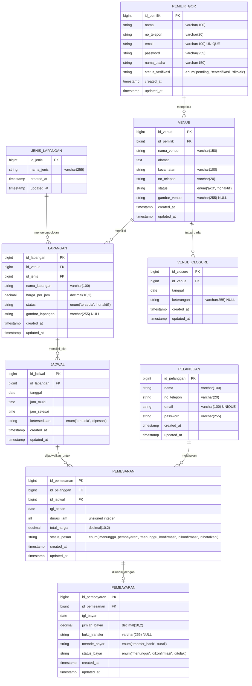

# SiGOR PKU - Portal Marketplace Booking Lapangan Olahraga Pekanbaru

SiGOR PKU adalah platform digital berbasis web (*marketplace*) yang dirancang khusus untuk mempermudah penyewaan lapangan olahraga (seperti bulu tangkis, futsal, dll.) di wilayah Kota Pekanbaru. Platform ini mempertemukan pemilik gedung olahraga (GOR) dengan pelanggan yang ingin memesan lapangan secara real-time, praktis, dan aman.

---

## 🛠️ Spesifikasi Teknologi & Bahasa Pemrograman

Di bagian awal ini, berikut adalah spesifikasi bahasa pemrograman dan tumpukan teknologi (*technology stack*) yang digunakan dalam pengembangan SiGOR PKU:

### 1. Bahasa Pemrograman & Dasar Web
*   **PHP (v8.3 / v8.4)**: Digunakan sebagai bahasa pemrograman utama pada sisi server (*backend*).
*   **JavaScript (ES6+)**: Digunakan untuk interaksi dinamis pada sisi klien (*frontend*).
*   **HTML5 & CSS3**: Kerangka struktur halaman dan styling dasar.
*   **SQL (PostgreSQL)**: Bahasa kueri untuk mengelola basis data relasional.

### 2. Frontend Stack
*   **Tailwind CSS (v4.0+)**: Framework CSS utilitas modern untuk membangun antarmuka pengguna (UI) yang responsif, cepat, dan memiliki estetika premium.
*   **Blade Templating Engine**: Sistem templating bawaan Laravel untuk memisahkan logika backend dengan struktur tampilan HTML secara bersih.
*   **FontAwesome (v6.4.0)**: Digunakan untuk kebutuhan ikonografi antarmuka.
*   **Google Fonts**: Menggunakan font *Plus Jakarta Sans* untuk tampilan judul dan *Inter* untuk kejelasan teks dokumen.

### 3. Backend Stack
*   **Laravel Framework (v13.0+)**: Framework MVC (Model-View-Controller) PHP modern yang tangguh untuk penanganan routing, keamanan, autentikasi multi-guard, dan manajemen database.
*   **Eloquent ORM**: Pemetaan objek relasional untuk interaksi database yang aman dari kueri SQL mentah.

### 4. Database & Layanan Cloud
*   **PostgreSQL**: Mesin database utama untuk menyimpan seluruh data relasional transaksi dan pengguna.
*   **Supabase Hosting**: Layanan cloud database PostgreSQL, menggunakan *Connection Pooler* pada port `6543` untuk mengoptimalkan performa transaksi serverless.

### 5. Deployment & Hosting
*   **Vercel**: Platform cloud serverless untuk men-deploy aplikasi secara global dengan perlindungan SSL otomatis dan optimalisasi waktu muat halaman.

---

## 📊 Entity Relationship Diagram (ERD)

Berikut adalah diagram relasi antarentitas (ERD) database SiGOR PKU berdasarkan migrasi tabel yang digunakan dalam sistem:



### Penjelasan Relasi Database:
1.  **Satu Pemilik GOR** dapat mendaftarkan dan mengelola **banyak Venue** (`pemilik_gors.id_pemilik -> venues.id_pemilik` - *One to Many*).
2.  **Satu Venue** dapat memiliki **banyak Lapangan** (`venues.id_venue -> lapangans.id_venue` - *One to Many*).
3.  **Setiap Lapangan** harus merujuk ke **satu Jenis Lapangan** / kategori cabang olahraga (`jenis_lapangans.id_jenis -> lapangans.id_jenis` - *Many to One*).
4.  **Setiap Lapangan** memiliki slot waktu sewa masing-masing yang disimpan dalam tabel **Jadwal** (`lapangans.id_lapangan -> jadwals.id_lapangan` - *One to Many*).
5.  **Pemesanan** menghubungkan **Pelanggan** dengan **Jadwal** yang dipilih (`pelanggan.id_pelanggan -> pemesanans.id_pelanggan` dan `jadwals.id_jadwal -> pemesanans.id_jadwal`).
6.  **Setiap Pemesanan** dapat melahirkan **satu transaksi Pembayaran** (`pemesanans.id_pemesanan -> pembayarans.id_pemesanan` - *One to One*).
7.  **Tabel Venue Closure** berfungsi sebagai log hari libur/tutup sementara GOR di mana pemesanan otomatis diblokir pada tanggal terkait (`venues.id_venue -> venue_closures.id_venue` - *One to Many*).

---

## 📋 Use Case Diagram

Berikut adalah alur penggunaan hak akses pengguna (Role/Actor) dalam ekosistem sistem booking SiGOR PKU:

```mermaid
graph TD
    %% Define Actors
    Pelanggan([👤 Pelanggan])
    Pemilik([🏢 Pemilik GOR])
    Admin([🔑 Administrator])

    subgraph Fitur Pelanggan
        UC1(Daftar & Login Pelanggan)
        UC2(Lihat & Cari Lapangan Olahraga)
        UC3(Melakukan Booking & Memilih Slot Waktu)
        UC4(Upload Bukti Pembayaran Transfer)
        UC5(Melihat Riwayat Sewa)
    end

    subgraph Fitur Pemilik GOR
        UC6(Daftar & Login Pemilik GOR)
        UC7(Kelola Profil GOR & Upload Foto)
        UC8(Kelola Unit Lapangan & Harga per Jam)
        UC9(Buat & Atur Jadwal Slot Waktu Tersedia)
        UC10(Verifikasi Transaksi Pembayaran Bukti Transfer)
        UC11(Atur Hari Penutupan GOR Libur/Renovasi)
    end

    subgraph Fitur Admin Utama
        UC12(Login Akun Admin)
        UC13(Verifikasi & Approve Akun Pemilik GOR Baru)
        UC14(Kelola Kategori Olahraga Jenis Lapangan)
    end

    %% Relations for Pelanggan
    Pelanggan --> UC1
    Pelanggan --> UC2
    Pelanggan --> UC3
    Pelanggan --> UC4
    Pelanggan --> UC5

    %% Relations for Pemilik GOR
    Pemilik --> UC6
    Pemilik --> UC7
    Pemilik --> UC8
    Pemilik --> UC9
    Pemilik --> UC10
    Pemilik --> UC11

    %% Relations for Admin
    Admin --> UC12
    Admin --> UC13
    Admin --> UC14
```



---

## ✨ Fitur Utama Sistem

1.  **Multi-Guard Authentication**: Sistem memisahkan sesi login untuk Admin, Pemilik GOR, dan Pelanggan secara terisolasi demi keamanan hak akses data.
2.  **Manajemen Jadwal Dinamis**: Pemilik GOR dapat dengan fleksibel menjadwalkan slot jam ketersediaan lapangan sesuai dengan jam operasional nyata.
3.  **Sistem Upload Bukti Transfer**: Pembayaran menggunakan sistem transfer bank tradisional di mana bukti fisik transfer dapat langsung diunggah oleh penyewa untuk kemudian divalidasi manual oleh pemilik GOR.
4.  **Sistem Penutupan GOR (Closure Date)**: Pemilik GOR dapat menutup seluruh operasional GOR pada tanggal tertentu (misalnya karena renovasi atau hari raya) sehingga pelanggan tidak dapat memesan pada hari tersebut.
5.  **Aesthetics Switcher (Tema Gelap/Terang)**: Antarmuka modern yang mendukung penyesuaian visual (*dark mode* dan *light mode*) yang gigih (*persistent*) menggunakan penyimpanan lokal (*local storage*).

---

## 🚀 Panduan Instalasi Lokal

Ikuti langkah-langkah di bawah ini untuk menjalankan proyek ini di komputer lokal Anda:

### Prasyarat
*   PHP >= 8.3 dengan ekstensi berikut yang aktif di `php.ini` Anda:
    ```ini
    extension=curl
    extension=fileinfo
    extension=gd
    extension=mbstring
    extension=openssl
    extension=pdo_pgsql
    extension=pgsql
    extension=zip
    ```
*   Composer
*   Node.js & NPM
*   Database PostgreSQL (Supabase / Lokal)

### Langkah Langkah Setup
1.  **Clone Repository**
    ```bash
    git clone https://github.com/username/SiGorPKU.git
    cd SiGorPKU
    ```

2.  **Instalasi Dependensi PHP & Javascript**
    ```bash
    composer install
    npm install
    ```

3.  **Konfigurasi File Environment**
    Salin file `.env.example` menjadi `.env` dan konfigurasikan koneksi PostgreSQL Supabase Anda:
    ```env
    DB_CONNECTION=pgsql
    DB_HOST=aws-1-ap-southeast-1.pooler.supabase.com
    DB_PORT=6543
    DB_DATABASE=postgres
    DB_USERNAME=postgres.vwikbtfsflrautvswbsw
    DB_PASSWORD=password_db_anda
    ```

4.  **Generate Application Key**
    ```bash
    php artisan key:generate
    ```

5.  **Jalankan Migrasi Database & Seeder**
    ```bash
    php artisan migrate --seed
    ```

6.  **Kompilasi Aset Frontend (CSS & JS)**
    ```bash
    npm run build
    ```

7.  **Jalankan Server Lokal**
    ```bash
    php artisan serve
    ```
    Buka **`http://127.0.0.1:8000`** di browser Anda untuk melihat aplikasi.

---

## 🔒 Lisensi
Proyek SiGOR PKU dikembangkan untuk penggunaan pribadi dan dilisensikan di bawah lisensi pihak pengembang utama.
